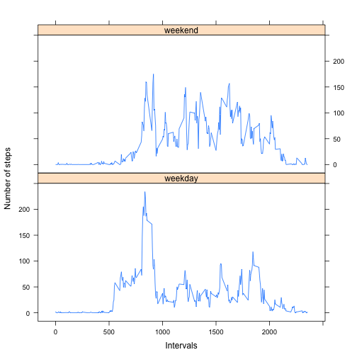

This is an R Markdown document, generated for the Peer Assignment 1 part of the 'Reprducible Research Course'. It's recommended to read the README.md first to understand the requested work.
##Loading the data and processing the data
Data for this study is extracted from WEB from the given address. You can find the web address under "url" variable in following codes. The data is in zip format. Following R codes downloades the data and unzip it to a csv ( , seperated) format. then the .csv file can be read in R as this:


```r
temp<- tempfile()
url <- "http://d396qusza40orc.cloudfront.net/repdata%2Fdata%2Factivity.zip"
download.file(url, temp)
unzip(temp)
 data <- read.csv("activity.csv")
```
##Processing the data

changing the date column format from Factor to Date:


```r
data$date<- as.Date(data$date, format="%Y-%m-%d")
```
Aggregating data by Day or Interval. We will use these aggregated data files later,


```r
aggSumByDay <- aggregate(steps ~ date, data, sum)
names(aggSumByDay)<- c("day", "totalsteps")
```


```r
aggSumByInterval<- aggregate(steps ~ interval, data, sum)
names(aggSumByInterval)[2]<- "totalsteps"

aggMeanByInterval<- aggregate(steps ~ interval, data, mean)
names(aggMeanByInterval)[2]<- "meansteps"
```

##Mean total number of steps per day

Now we need to find out what's the average number of steps that this individual has taken in each day.
Average total number of steps per day for this individual is:


```r
mean(aggSumByDay$totalsteps)
```

```
## [1] 10766.19
```

##What is the average daily activity pattern?

To answer this question we need to plot the time series. This data has been taken from 20012-10-02 to 2012-11-19 for every 5 minutes interval.
So we have enough data point to plot a time series.


```r
plot(meansteps ~ interval, data=aggMeanByInterval, 
                   type="l", ylab=" average number of steps taken",
                             xlab="interval", main=" Time Series Plot of average daily pattern ")
```

 

##Missing values 

We first calculate the number of missing data.


```r
sum(is.na(data$steps))
```

```
## [1] 2304
```

##Finding a replacement for the missing values

To keep the procedure very simple, I decided to replace the missing steps values by the average steps taken in all 5 minutes intervals.


```r
new.data<- data # start with duplicating original data
missing.replacement <- mean(aggMeanByInterval$steps)
```

```
## Warning in mean.default(aggMeanByInterval$steps): argument is not numeric
## or logical: returning NA
```

```r
new.data$steps[is.na(new.data$steps)] <- missing.replacement
```

##Are there differences in activity patterns between weekdays and weekends?


```r
new.data$weekdays <- factor(format(new.data$date, "%A"))
levels(new.data$weekdays)  # making sure all different factors are week days
```

```
## [1] "Friday"    "Monday"    "Saturday"  "Sunday"    "Thursday"  "Tuesday"  
## [7] "Wednesday"
```
Now because we are investigating about the difference between weekend days and weekdays we can change the weekdays column to two factors, (weekday, weekend)


```r
days<- list(weekday = c("Monday", "Tuesday", "Wednesday", 
    "Thursday", "Friday"), weekend = c("Saturday", "Sunday"))
levels(new.data$weekdays)<- days 
new.data.mean.by.interval <- aggregate(new.data$steps, by = list(new.data$weekdays, 
    new.data$interval),  mean, na.rm = TRUE, na.action = NULL)

names(new.data.mean.by.interval)<- c("weekdays","intervals","mean.steps")

xyplot(new.data.mean.by.interval$mean.steps ~ new.data.mean.by.interval$intervals | 
    new.data.mean.by.interval$weekdays, layout = c(1, 2), type = "l", xlab = "Intervals", 
    ylab = "Number of steps")
```

 

Average number of steps on weekends seems to be higher. This person is more active on weekends


```r
new.data.mean.by.weekday<- aggregate(steps ~ weekdays, new.data,mean)
new.data.mean.by.weekday
```

```
##   weekdays    steps
## 1  weekday 35.33796
## 2  weekend 43.07837
```
    
